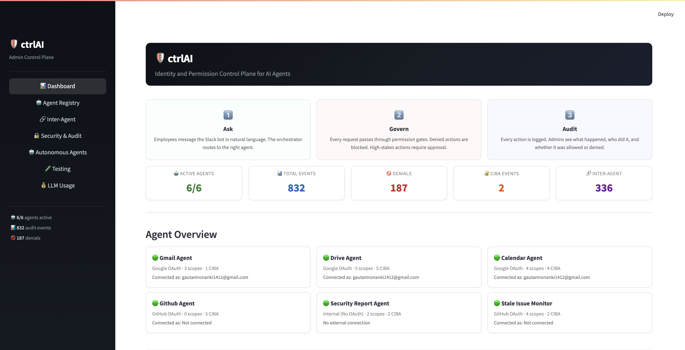
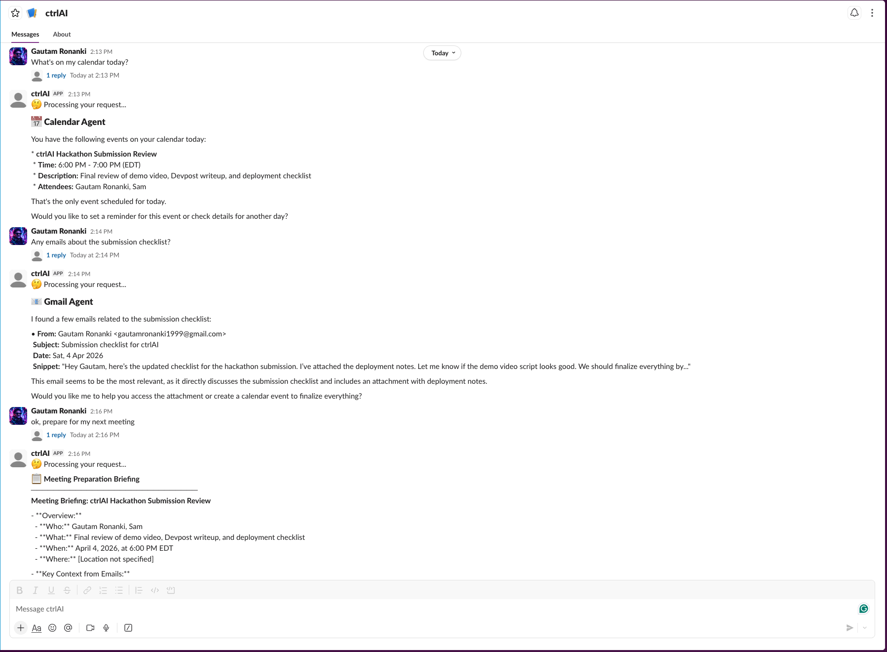

# ctrlAI

**IAM for AI Agents**

Identity and permission control plane for AI agents, demonstrated through a Slack bot and admin dashboard that governs Gmail, Drive, Calendar, and GitHub agents with Auth0 Token Vault, CIBA human approval, audit trails, and inter-agent permission controls.

Built for the [Authorized to Act](https://authorizedtoact.devpost.com/) hackathon.

> **[Live Demo](https://ctrlai.streamlit.app)** · **[Demo Video](https://www.youtube.com/watch?v=D5DRcUzi42c)** · **[Devpost Submission](https://devpost.com/software/ctrlai)**

---

Organizations are starting to run AI agents that read emails, manage calendars, touch code repositories, and handle documents. These agents need OAuth tokens to do their jobs. But right now, most agent setups hand out a single set of credentials and hope for the best. No scoping, no audit trail, no way to revoke access without killing everything.

ctrlAI treats every AI agent as a governed identity. Each agent gets explicitly scoped permissions, inter-agent communication rules, and a full audit trail, the same way you'd manage human access in an enterprise, but for AI agents. If an agent shouldn't be able to delete files, it can't. If it tries, it gets blocked and logged.

Token Vault stores the credentials. ctrlAI governs who gets to use them and how.

---

## What It Looks Like

**Admin Dashboard** - agent registry, permission management, inter-agent matrix, audit log, security reports, eval suite, LLM usage tracking across 7 pages.



**Slack Bot** - employees message in natural language. The orchestrator routes to the right agent, enforces permissions, and returns results. Notice the permission denial at the top: Drive Agent was blocked because its read permission was revoked on the dashboard.



---

## How It Works

Every request flows through a LangGraph orchestrator that checks permissions before any agent touches an API:

```
Employee (Slack)
    |
    v
LangGraph Orchestrator
    1. Route          LLM identifies the right agent
    2. Permission     Is this agent allowed to do this?
    3. Token          Fetch scoped token from Token Vault
    4. CIBA           High-stakes? Get human approval first
    5. Execute        Agent calls the API
    6. Format         Return result to Slack
    |
    v
Admin Dashboard (Streamlit)
    Agent Registry · Permission Matrix · Audit Log
    Security Reports · Eval Suite · LLM Usage
```

If the agent isn't active, or the scope is revoked, or the action needs approval, the request stops. No silent failures.

---

## The Agents

| Agent | Provider | What It Can Do | Needs Approval |
|-------|----------|---------------|----------------|
| Gmail Agent | Google | Read, search, list, send emails | Sending email |
| Drive Agent | Google | List, search, read, create, delete files | Deleting files |
| Calendar Agent | Google | List, read, create, modify events | Creating events |
| GitHub Agent | GitHub | List repos/issues, read, post comments | Posting comments |
| Security Report | Internal | Analyze audit trail, escalate via inter-agent | None (internal only) |
| Stale Issue Monitor | GitHub | Detect stale issues, post comments, add labels | Comments, labels |

Three Google agents share a single OAuth connection, but each has independently scoped permissions. The governance layer operates at the agent identity level, not the provider level. Sharing a connection does not mean sharing access.

---

## What Makes This Different

**Permissions are enforced at runtime.** Every request passes through a chain: agent exists, agent active, rate limit check, scope check, temporary grant fallback. Revoke a scope on the dashboard and the next Slack message is denied. No restart needed. This isn't config-file policy that lives in a YAML somewhere. The enforcement layer runs on every single request.

**CIBA with Guardian push notifications for high-stakes actions.** When an employee triggers a high-stakes action through Slack (sending an email, deleting a file, posting a public comment), the system initiates a real Auth0 CIBA flow. The admin gets a Guardian push notification on their phone. The agent waits. If the admin doesn't approve, nothing happens. For dashboard-triggered autonomous actions (Security Report, Stale Issue Monitor), approval is handled through the dashboard UI before execution.

**Inter-agent communication is governed by a deny-by-default matrix.** Agents can't freely call each other. The meeting-prep workflow demonstrates this concretely: Calendar Agent asks Gmail Agent for email context (allowed), then asks Drive Agent for related files (denied, not in the matrix). The final briefing transparently reports which permissions were used and which were blocked.

**Autonomous agents live under the same governance as employee-triggered ones.** The Security Report Agent reads the audit trail and can escalate alerts through Gmail Agent, but only because the inter-agent matrix explicitly permits that path. The Stale Issue Monitor fetches its own GitHub token from Token Vault and still requires dashboard approval before posting comments or adding labels.

**The eval suite tests real enforcement.** Four tests temporarily revoke a scope, suspend an agent, remove inter-agent access, and modify high-stakes config, then verify the enforcement layer actually responds, then restore everything in `try/finally` blocks. Around 110-150 tests total, generated dynamically from the live permission state. Change a permission on the dashboard, run evals, and the test suite adapts.

**Slack session summaries show what happened.** After normal Slack requests and workflows, a threaded summary shows the user which agent ran, what services were accessed, what was blocked, and whether human approval was involved. Transparency isn't just an admin feature.

**Temporary access grants with auto-expiry.** Admins can grant time-limited scope access to an agent that automatically expires after a specified number of minutes. Useful for one-off tasks where you don't want to permanently expand an agent's permissions.

---

## Security

- Token Vault is the credential boundary. Agents retrieve a provider token from Token Vault at execution time, only after ctrlAI's permission checks pass, and discard it after the request. Tokens never appear in logs or prompts.
- CIBA (Guardian push) for Slack-triggered high-stakes actions. Dashboard approval buttons for autonomous agent actions.
- Rate limiting per agent (20 req/60s) with automatic blocking and audit logging
- Dashboard protected by password via environment variable
- Temporary access grants with auto-expiry
- Action name normalization prevents scope bypass via naming variants (`send_email` and `send_emails` resolve to the same check)
- Complete JSONL audit trail with timestamp, agent, action, status, and details

**Note on OAuth scopes in the demo:** The Google connected account requests combined Gmail, Calendar, and Drive scopes through a single OAuth connection. GitHub requests repo and user scopes. The permission governance that restricts what each agent can actually do with those scopes is enforced by ctrlAI's permission layer, not by OAuth scope boundaries. In production, per-agent credential isolation via Token Vault's multi-user support would tighten this further.

---

## Prerequisites

Before running ctrlAI locally, make sure you have:

- Python 3.12
- An Auth0 tenant with a confidential application configured for the callback URLs used by this repo:
  - `http://localhost:8000/callback`
  - `http://localhost:8000/connect/google/callback`
  - `http://localhost:8000/connect/github/callback`
  - Logout URL: `http://localhost:8000/`
- Auth0 refresh tokens enabled (`offline_access`) for the login flow
- Auth0 CIBA + Guardian configured, with the approving user set as `EMERGENCY_COORDINATOR_USER_ID`
- Google (`google-oauth2`) and GitHub (`github`) connected-account flows available on your Auth0 tenant for the same application
- A Slack app installed to a workspace, running in Socket Mode, with a bot token and app-level token
- An OpenAI API key
- Google and GitHub accounts you can connect during the demo flow

> **Important:** the linking flow in this repo uses Auth0's My Account / Connected Accounts endpoints (`/me/v1/connected-accounts/*`). If those endpoints are not provisioned on your tenant, the connect/disconnect routes in `app.py` will not complete successfully.

---

## Quick Start

```bash
git clone https://github.com/GautamRonanki/ctrlAI.git
cd ctrlAI
python -m venv .venv && source .venv/bin/activate
pip install -r requirements.txt
cp .env.example .env  # Fill in your credentials

# Three processes, three terminals:
python app.py                    # FastAPI backend
streamlit run dashboard/app.py   # Admin dashboard
python -m slack_bot.app          # Slack bot
```

See `.env.example` for required variables (Auth0, OpenAI, Slack credentials).

---

## First Local Run

After the three processes are running:

1. Open `http://localhost:8000`
2. Click **Login** and authenticate with the Auth0 user that has Guardian enrolled
3. From the FastAPI home page, connect Google and GitHub to Token Vault:
   - `Connect Google Account to Token Vault`
   - `Connect GitHub Account to Token Vault`
4. The login callback persists the refresh token to `config/token_store.json`, which the Slack bot and autonomous agents reuse
5. Optional smoke tests from the FastAPI app:
   - `http://localhost:8000/test/gmail`
   - `http://localhost:8000/api/agents/github/repos`
6. Open the admin dashboard at `http://localhost:8501`
7. If you configured your own Slack workspace and app, message the Slack bot with prompts like:
   - `Prepare for my next meeting`
   - `Show me my recent emails`
   - `Send a follow-up email to Sam saying I reviewed the checklist`

If `DASHBOARD_PASSWORD` is set, the Streamlit dashboard will prompt for it before showing the admin pages.

---

## Testing Instructions

If you're reviewing the project without setting up your own credentials, use these in order:

1. Watch the [demo video](https://www.youtube.com/watch?v=D5DRcUzi42c)
2. Open the [Devpost submission](https://devpost.com/software/ctrlai) for the project summary
3. Explore the [live dashboard](https://ctrlai.streamlit.app)
   - Password: `auth0okta`
4. Browse the screenshots and source code in this repo

The Slack bot shown in the demo is connected to a private workspace used for the project demo. Public reviewers should treat the video as the canonical walkthrough of the employee-facing Slack experience. Reproducing the Slack flow locally requires creating your own Slack app, installing it into your own workspace, and supplying your own bot/app tokens.

For full end-to-end local verification, you need your own Auth0 tenant, Slack workspace, Google account, GitHub account, and Guardian-enrolled approving user. The public repo intentionally does not include private credentials.

Useful local verification paths:

- `python -m core.evals` for the dynamic evaluation suite
- `http://localhost:8000/test/gmail` after connecting Google
- `http://localhost:8000/api/agents/github/repos` after connecting GitHub
- The live dashboard for admin controls, audit logs, autonomous agents, and eval results
- High-stakes Slack actions to exercise the Guardian approval flow if you configure your own Slack workspace

---

## Tech Stack

| Layer | Technology |
|-------|-----------|
| Language | Python 3.12 |
| Orchestration | LangGraph |
| LLM | GPT-4o-mini (OpenAI) |
| Backend | FastAPI |
| Admin UI | Streamlit |
| User Interface | Slack (Socket Mode) |
| Auth | Auth0 Token Vault + CIBA + Guardian |

---

## Demo Scope

This is a hackathon demo. Here's what's simplified:

- Single user with one shared Auth0 refresh token (production: per-agent credential isolation via Token Vault multi-user)
- Connected-account linking assumes Auth0 My Account / Connected Accounts endpoints are available on the tenant
- OAuth login uses basic session cookies without CSRF state parameter
- Inter-agent actions return simulated results rather than calling real target agent functions
- The FastAPI web interface is a developer tool for OAuth setup. The Slack bot and dashboard are the user-facing interfaces.

---

## Vision

| | Demo | Production |
|--|------|-----------|
| Users | 1 admin | Multi-tenant, per-user scoping |
| Agents | 6 | Dynamic registration, hundreds |
| Providers | Google + GitHub | Any OAuth provider via Token Vault |
| Credentials | Shared refresh token | Per-agent isolation |
| Approval | Guardian push + dashboard | Push + SMS + email fallbacks |
| Persistence | Local JSON files | Database + SIEM integration |

Scaling from 6 agents to 600 means adding agent definitions. The governance engine stays the same.

---

## License

MIT
